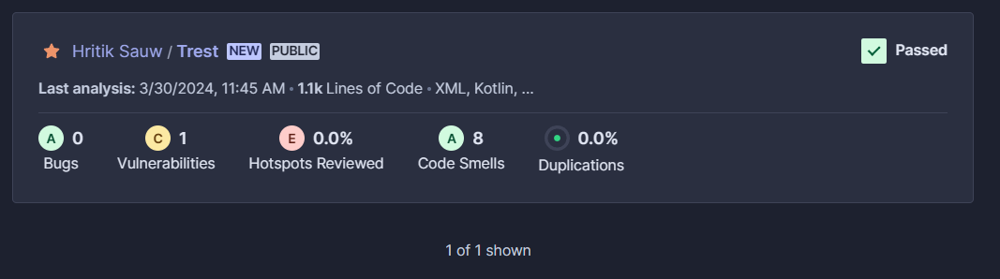
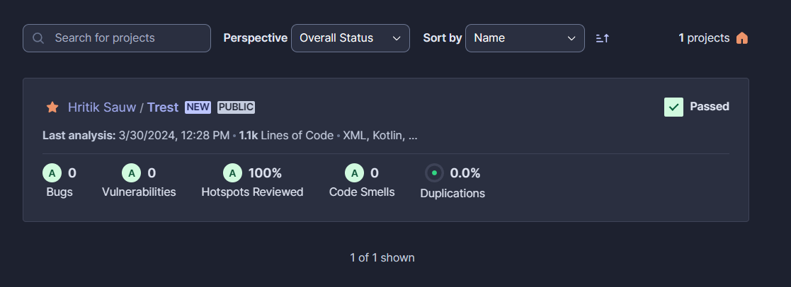
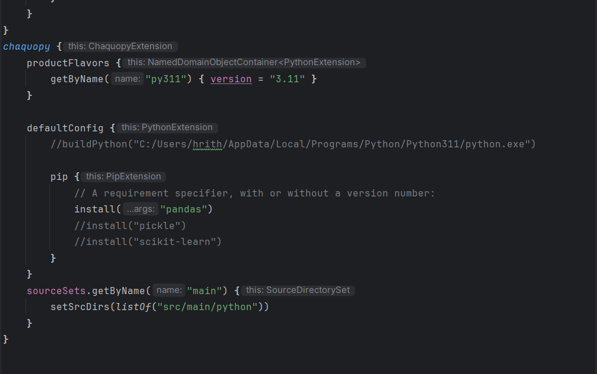
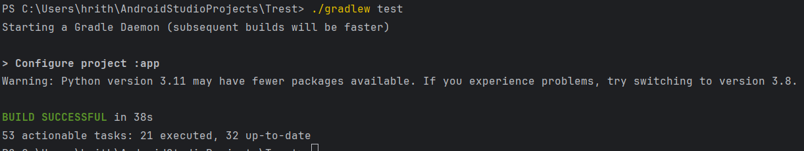
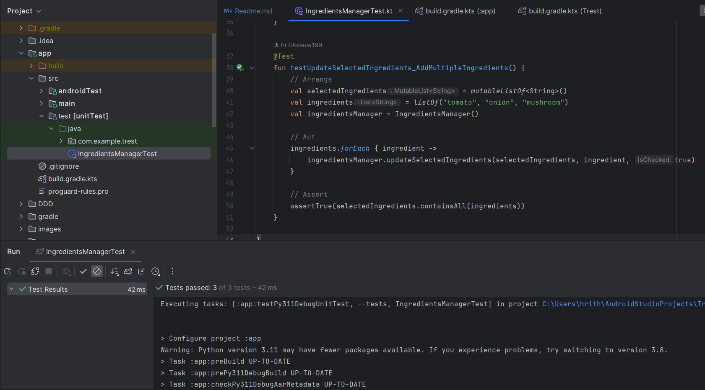
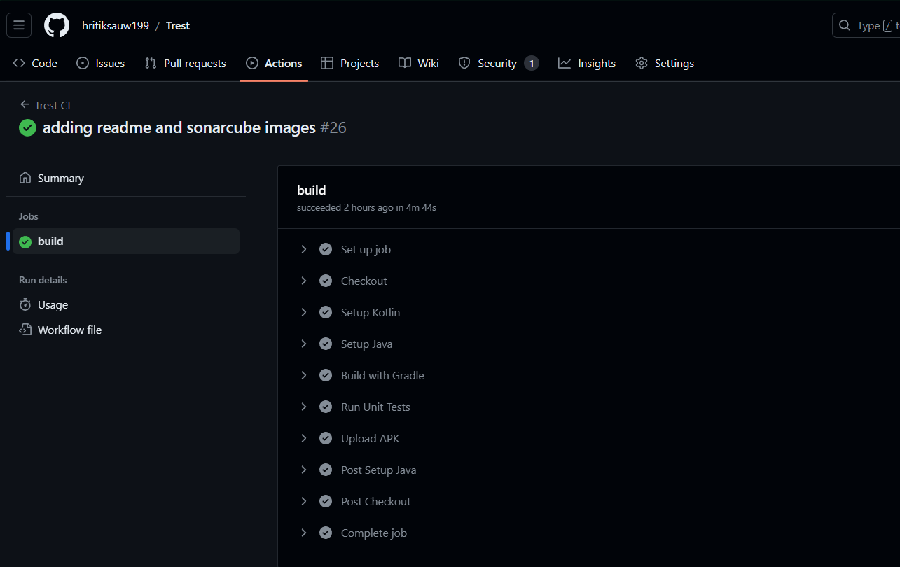

# Smart Recipe App: Learning your taste with Machine Learning

Struggling to decide what to cook? The smart recipe app is here to help! It suggests recipes based on the ingredients you already have at home, making meal planning a breeze. What makes this app unique? Think of it as your personal recipe assistant - which learn your taste preferences through quizzes and suggestions using Machine Learning, providing customized recommendations just for you.

No more kitchen headaches, just tasty meals made easy! :)

A quick glimpse of the app's basic functionality can be viewed here:

# 1. Git

I've been using Git since my university days, mostly as a portfolio to host my projects. The thing I love the most is how I can host on my projects on Github and access it via different machines or say have multiple people collaborate together (done so in past projects).

Even in this project, as I was using multiple IDE (IntelliJ, VSC, Android Studio) it was very seamless to make changes on one IDE and have it reflected and ready to use on another. Additionally, I got to learn about Github Actions through this project which was new to me.

**Issues Faced**

While working on this project, I faced 2 major hurdles which I rectified using git commands (sadly I forgot to take screenshots of the issues🥲🥲).

1. I accidentally committed the recipe dataset and since it was around 600 it was not pushing to Github. After several trials, I was able to solve it using (it basically removed the file from the staging area)

   `git checkout -- recipes.csv`

2. Another issue was when I made a pipeline using Github Actions, in that when I called `./gradlew build` command for the first time, it showed permission denied. After looking through some stackoverflow posts, I was able to solve it using

   `git update-index --chmod=+x gradlew`

   and then the usual process of add, commit and push.

# 2. UML

Honestly, UML and DDD was the toughest part in this entire project. At first, I was like what is this thing, why is it even required and the online resources were equally bad. It took me 2 weeks to finally understand the concepts and the crucial role it plays in a project.

If I were to define UML, I would say I see it as a tool to sketch out the blueprint or design of your project. It's like visualizing how everything should be structured and how it will appear on the user interface (sortof).

I made these three UML diagrams for this project
1. [Activity Diagram](UML/activity.png)
2. [Class Diagram](UML/class_diagram.jpg)
3. [Use Case Diagram](UML/use_case_diagram.png)

# 3. DDD

This part was surprisingly enjoyable for me; I had a lot of fun eventstorming new ideas and trying to cram every problem known to mankind onto the eventstorming board (pun intended). I learned so much about software architecture during this process, especially about things like ubiquitous language and how different domains are mapped in a context map.

DDD is like a way to organize the project based on the practical problems it's solving. It's like building your software around the actual concepts and language used in the problem domain, making the  code more aligned with the business needs.

DDD for the following project are:
1. [Event Storming_1](DDD/event_storming_1.png)
2. [Event Storming_2](DDD/event_storming_2.png)
3. [Core-Domain Chart](DDD/core%20domain.png)
4. [Context Mapping](DDD/mappings.jpg)

A glimpse into the behind-the-scenes of making these diagrams

# 4. Metrics

To assess the metrics, I opted for SonarQube. The setup process was straightforward - simply linking my GitHub account to Sonarcube Cloud, and it automatically started analyzing the code with every change.

Some Key metrics considered include:

- Maintainability/code smell
- Duplications
- Security/vulnerabilities
- Bug detection

Initially, the analysis revealed a bunch of issues that needed attention. But, with some tweaking and fixing, I managed to rectify those issues.
I've attached a snapshot showing the before-and-after comparison.

**Before**

**After**

And for more details on the bugs and how I fixed them, check out the [SonarQube folder](sonar/readme.md).

# 5. Clean Code Development

# 6. Build Management

Gradle is a powerful build automation tool primarily used for Java projects, including Android applications. It simplifies the process of managing dependencies, compiling code, and executing various tasks required for building software projects.

While developing the app, I heavily relied on Gradle as a Build Management System to compile and debug the application as it was integrated directly into the Android Studio IDE. This also included adding any extra dependencies or configuring the build system so that it compiles the code smoothly.

One such instance was the configuration of Chaquopy. I needed to implement several Python code which would generate recipe recommendation given inputs from the app. It helped me implement several python logic into the app (although Flask API would have been a better option but I have no experience in it). For this to work, I had to add various libraries and dependencies into the Gradle build configurations, which you can see below

Lastly, I also utilized the `./gradlew test` test module to validate if all my codebase components are working properly or not.

**The entire gradle file you can access here**: [Gradle file](app/build.gradle.kts)

**The build logs after executing build can be viewed here**: [Gradle Build](build_logs.pdf)

# 7. Unit Test

Unit testing plays a crucial role in ensuring the reliability and correctness of software applications. It involves testing individual units or components of the codebase in isolation to verify that they function as expected.

In my app, I incorporated unit tests to validate the working of various functions within the application. I used the built-in testing framework in the Android Studio IDE.

The method is to annotate functions with the '@Test' parameter, indicating that they should behave as unit tests. Since these unit tests are built directly into the IDE, the unittest are integrated directly into the Build Sytem and are also executed when the compile the code using Gradle.

**The entire unit-test code can be found here:** [Unit Test file](app/src/test/java/IngredientsManagerTest.kt)

And the build output after executing the code is shown below

# 8. Continuous Delivery

This concept of Pipelines and Github Actions was entirely new to me. Having used Github for many years, I was still unaware about Github Actions and how to build pipelines on it.

For this project, I found a helpful YouTube channel that guided me through the process of setting up and running the pipeline using GitHub Actions. I followed the procedures as described but when the command `./gradlew build` was about to execute it kept showing me **permission denied** error.

After hours, I found the solution to it in a stackoverflow post which I have mentioned above in the **Git section, issue 2**

The flow of my GitHub Actions pipeline is as follows:
- a push or pull request on the branch,triggers the pipeline.
- The pipeline initiates by checking out the repository
- Set up Kotlin and Java environments.
- Build is executed
- Test function
- If all tests pass successfully, upload the APK file.

**The configuration file for the pipeline can be found here:** [Pipeline](.github/workflows/main.yml)

The output of the pipeline is shown below

# 9. IDE

For this project, I juggled between multiple IDEs to accomplish different tasks efficiently.
Here's an overview of how I utilized each one:

1. **Android Studio**: This was my primary IDE, where I wrote code and designed the layout of the app.

2. **IntelliJ IDEA**: I used IntelliJ IDEA to test and verify Kotlin commands that I planned to incorporate into my app.

3. **Visual Studio Code (VSC)**: For writing the project's README.md file, as other IDE didn't provide preview of .md file while writing.

4. **Jupyter Notebook**: To write and test Python code, which would later be integrated into the app.

As for key shortcuts in Android Studio IDE, here are a few handy ones:

- `Ctrl + Alt + L`: Reformat code.
- `Ctrl + / (on a line of code)`: Comment/uncomment a line of code.
- `Ctrl + Shift + F`: Search everywhere (classes, files, actions, etc.).
- `Ctrl + E`: Open recent files.
- `Ctrl + Alt + S`: Open settings and configurartions dialog.
- `Ctrl + Shift + Alt + N`: Navigate to a class, file, or symbol by name.
- `Alt + Enter`: Show intention actions (quick fixes) for the selected code.
- `Ctrl + Alt + O`: Optimize imports (remove unused imports).

# 10. DSL

# 11. Functional Programming

# Future improvements

# References

1. https://medium.com/raa-labs/part-1-domain-driven-design-like-a-pro-f9e78d081f10
2. https://youtube.com/playlist?list=PLZBNtT95PIW3BPNYF5pYOi4MJjg_boXCG&si=jISClAZuHWCCXCSX
3. https://ddd-crew.github.io/ddd-starter-modelling-process/
4. https://miro.com/app/board/uXjVNmOe3uY=/
5. https://github.com/ddd-crew/context-mapping
6. https://www.visual-paradigm.com/guide/uml-unified-modeling-language/what-is-activity-diagram/\
7. https://developer.android.com/courses/android-basics-compose/unit-1?_gl=1*1d2fqgr*_up*MQ..&gclid=Cj0KCQjwqdqvBhCPARIsANrmZhNXnqLWIMxgH3R7P4yS3V-b3t-Y0QP1MfV7xM9MJ6x8Wv_smVLa1EgaAuicEALw_wcB&gclsrc=aw.ds
8. https://stackoverflow.com/questions/68460171/how-to-merge-master-branch-into-main
9. https://www.vectorstock.com/
10. https://www.youtube.com/watch?v=hkZE6WIlS4c
11. https://stackoverflow.com/questions/20002557/how-to-remove-a-too-large-file-in-a-commit-when-my-branch-is-ahead-of-master-by
12. https://stackoverflow.com/questions/17668265/gradlew-permission-denied
13. https://superuser.com/questions/1806941/java-17-is-required-instead-of-java-11-android-ci-cd-github-actions
14. https://www.youtube.com/watch?v=SVLyADb8rQc
15. https://community.sonarsource.com/t/how-do-you-set-python-version-in-sonarcloud-ui/48775